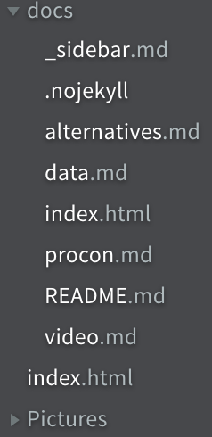

# Data Structure
Docsify is a bit different from all the other options. Some of the other solutions generate custom directories with UUID or numerical names. Docsify does not have a graphical interface, so navigation relies on links and navigation bars. With this, it is up to the developer to create directories and files, and then creates the links to the files. In this sense, Docsify does not have a file hierarchy. The only required directory is the docs directory, which is automatically created when Docsify is initialized. 

# Screenshots and examples

This is this site's hierarchy. All pictures live in the Pictures directory. The rest of the files make up the navigation bar and the pages. When a link is clicked in the side bar, Docsify requests the markdown file as a webpage, and the content is rendered. Nothing complicated is going on with UUIDs or numbered folders; only the file path is needed.

